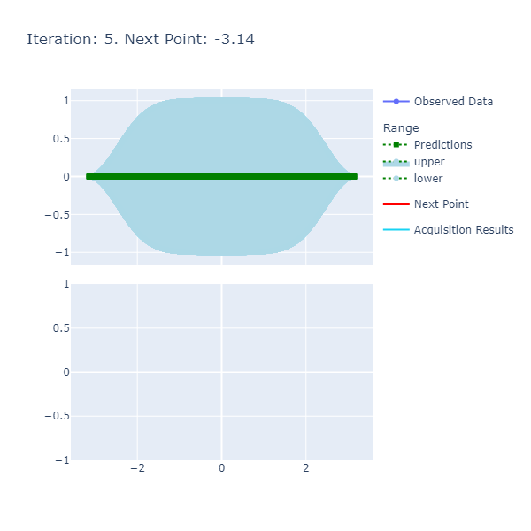
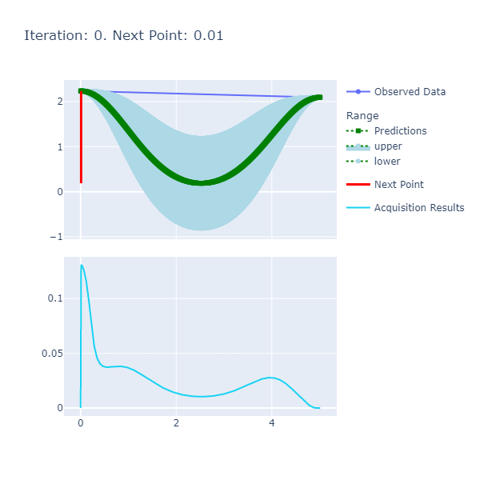

# FSharp Advent Submission 2022: Bayesian Optimization for Performance Tuning in FSharp


## Introduction

For my 6th F# Advent submission (6 years in a row!!), I worked on combining what I learnt from my last 2 submissions: [2020: Bayesian Inference in FSharp](http://bit.ly/3hhhRjq) and [2021: Perf Avore: A Performance Analysis and Monitoring Tool in FSharp](https://github.com/MokoSan/PerfAvore/blob/main/AdventSubmission.md#perf-avore-a-performance-analysis-and-monitoring-tool-in-fsharp) to develop a Bayesian Optimization algorithm in F# to solve global optimization problems for a single variable. This algorithm is compatible with complex black-box objective functions such as those dictated by the results of profiles via Event Tracing for Windows (ETW), a Windows profiling mechanism for troubleshooting and diagnostics, in an effort to discern the best parameters to use based on the specified workload or process. In this submission, I plan to demonstrate how I developed and applied the Bayesian Optimization algorithm to various experiments to obtain the best parameters and highlight how I made use of F#'s functional features. In terms of using F#, I have had a fabulous experience, as always! I have expounded on this [here](#experience-developing-in-fsharp).

If some or all parts of the aforementioned aspects of the introduction so far seem cryptic, fret not as I plan to cover these topics in detail. The intended audience of this submission is any developer, data scientist or performance engineer interested in how the Bayesian Optimization algorithm is implemented in a functional-first way.

## Goals

To be concrete, the goals of this submission are:

1. [To Describe Bayesian Optimization](#bayesian-optimization). 
2. [Present the Multiple Applications of the Bayesian Optimization from Simple to more Complex](#experiments):
   1. [Maximizing ``Sin`` function between -π and π.](#experiment-1-maximizing-the-sin-function-between-π-and--π)
   2. [Minimizing The Wall Clock Time of A Simple Command Line App](#experiment-2-minimizing-the-wall-clock-time-of-a-simple-command-line-app): Finding the minima of the wall clock time of execution of an independent process based on the input.
   3. [Minimizing The Percent of Time Spent during Garbage Collection For a High Memory Load Case With Bursty Allocations By Varying The Number of Heaps](#experiment-3-minimizing-the-wall-clock-execution-time-by-varying): Finding the minima of the percent of time spent during garbage collection based on pivoting on the number of Garbage Collection Heaps or Threads using Traces obtained via Event Tracing For Windows (ETW). 
      1. [Give a short primer on ETW Profiling.](#event-tracing-for-windows-etw-primer)
3. [Describe the Implementation of the Bayesian Optimization Algorithm and Infrastructure](#implementation-of-bayesian-optimization-in-fsharp)

## Bayesian Optimization

The goal of any mathematical optimization function is the selection of the best element vis-à-vis some criterion known as the objective function from a number of available alternatives; the best element or optima here can be either the one that minimizes the criterion or maximizes it. Mathematically, this can expressed as:

$$ \arg \max_{x} f(x) $$

or finding the argument $x$ that maximizes (minimization is just the negative of maximization) the function, $f(x)$ known more generally as the __optima__. The "direction" of the optimization i.e. whether we are minimizing or maximizing can be modeled as "Goal" such as:

```fsharp
type Goal =
    | Max
    | Min
```

The way I understood this algorithm was through a [socratic approach](https://en.wikipedia.org/wiki/Socratic_method) and here are the questions I had when I first started that I gradually answered:

### What is Bayesian Optimization And Why Use It?

Bayesian Optimization is an iterative optimization algorithm used to find the most optimal element like any other optimization algorithm however, where it shines in comparison to others is when the criterion or objective function is a black box function. A black box function indicates the prospect of a lack of an analytic expression or known mathematical formula for the objective function and/or details about other properties for example, knowing if the derivative exists for the function so as to make use of other optimization techniques such as [Stochastic Gradient Descent](https://en.wikipedia.org/wiki/Stochastic_gradient_descent).

To contrast with 2 other optimization techniques namely, **Grid Search Optimization** and **Random Search Optimization**.

To summarize, Bayesian Optimization aims to, with the fewest number of iterations, find the global optima of a function that could be a black box based function.

### What Are The Components of a Bayesian Optimization Algorithm? 

There are 3 main components:

1. __Surrogate Model__: The surrogate model is used as for approximation of the objective function where new points can be fit and predictions can be made. More details are [here](#surrogate-model).
2. __Acquisition Function__: The acquisition function helps discerning the next point to sample per iteration. More details are [here](#acquisition-function)
3. __Iteration Loop__: The loop that facilitates the following from 1 to some defined iteration count that does the following and at the end of the iterations, the expectation is that you'd have explored enough data points to discern as the maxima:
   1. Make predictions using the surrogate model. 
   2. Based on the predictions from 1., apply the acquisition function.
   3. Identify the point that maximizes the acquisition function. 
   4. Update the model with the new data point.

Diagrammatically,


### What is 'Bayesian' About the Bayesian Optimization Algorithm? 

The efficiency of the Bayesian Optimization algorithm stems from the use of Bayes Theorem to direct the search of the global optima by updating prior beliefs about the state of the objective function in light of new observations made by sampling or choosing the next point to evaluate as a potential candidate of the optima. For those new to the world of Bayes Theorem, I have written up a summary that can be found [here](https://nbviewer.org/github/MokoSan/FSharpAdvent_2020/blob/main/BayesianInferenceInF%23.ipynb#Bayes-Theorem) as a part of my previous advent submission. 

To elaborate just a bit more here (there is a section below under [Gaussian Processes](#gaussian-processes) that covers the model most commonly used for this purpose of approximating the objective function), we choose a surrogate model that helps us with approximating the objective function that's initialized based on some prior information and is updated as and when we sample or observe new data points and with each subsequent iteration, we are constructing a posterior distribution that is more closely representative of the actual objective function whose form can be an unknown.

### What are some of the disadvantages of the Bayesian Optimization Algorithm?

Some disadvantages include:

1. __Results Are Extremely Sensitive To Model Parameters__: Having some prior knowledge of the shape of the objective function is helpful as otherwise, choosing the wrong parameters results in a need for a higher number of iterations or sometimes convergence to the optima isn't even possible. The previous implication requires "optimization of the optimizer". Additionally, this effect is amplified with a inputs of higher dimensions i.e. you have to carefully choose the model parameters for a lot of variables. As we will see later, we need to make some reasonable choices in terms of:
   1. The Kernel Parameters.
   2. Resolution of the Initial Data or how granular our model should be in terms of data points.
   3. Number of iterations. 
2. __Model Estimation Takes Time__: Getting the surrogate model to a point where it is behaving like a reasonable approximation of the true objective function can take quite a few iterations, which implies more time spent to get the result. 
3. __Naive Implementation Isn't Parallelizable By Default__: We need to add more complexity to the model to be able to parallelize the algorithm.

### What are the Inputs of the Model To Get A Basic Run Going?

1. __Kernel Parameters For the Squared Exponential Kernel: Length Scale and Variance__: The length controls the smoothness between the points while the Variance controls the vertical amplitude. A diagram can help explain this better:


2. __Resolution__: 


3. __Iterations__: The number of iterations the Bayesian Optimization Algorithm should run for. The more the better, however, we'd be wasting cycles if we have already reached the maxima and are continuing to iterate; this can be curtailed by early stopping.


### How Do I Interpret the Charts of the Algorithm Below? 

An example of a chart the algorithm is:



Here are the details:

1. __Predictions__: The predictions represent the mean of the results obtained from the underlying model that's the approximate of the unknown objective function. This model is also known as the Surrogate Model and more details about this can be found [here](#surrogate-model)
2. __Acquisition Results__ series represents the acquisition function whose maxima indicates where it is best to search. More details on how the next point to search is discerned can be found [here](#acquisition-function).
3. __Next Point__: The next point is derived from the maximization of the acquisition function and points to where we should sample next.
4. __Observed Data__: The observed data is the data collected from iteratively maximizing the acquisition function. As the number of observed data points increases with increased iterations, the expectation is that the predictions and observed data points converge if the model parameters are set correctly.

Now that a basic definition, reason and other preliminary questions and answers for using Bayesian Optimization are presented, I want to provide some pertinent examples that'll help with contextualizing the associated ideas and highlight the usage of the library.

## Experiments

In this section, I plan to go over 3 main experiments conducted using the optimization algorithm to demonstrate the efficacy of the algorithm and ease of use of the library.

### Experiment 1: Maximizing the ``Sin`` function between π and -π.

``Sin(x)`` is a simple Trigonometric Function whose maximum value is 1 at $\frac{\pi}{2}$ if the range is between $-\pi$ and $\pi$. Since we know the analytical form of the function, this simple experiment can highlight the correctness of the algorithm (within an acceptable margin of error). A [Polyglot notebook](https://devblogs.microsoft.com/dotnet/dotnet-interactive-notebooks-is-now-polyglot-notebooks/) of this experiment can be found [here](./Experiments/Sin/Sin.ipynb). 

The experiment can be setup in the following way making use of the library I developed that implements the Bayesian Optimization algorithm:

```fsharp
open Optimization.Domain
open Optimization.Model
open Optimization.Charting

let iterations : int = 10
let resolution : int = 20_000 

// Creating the Model.
let gaussianModelForSin() : GaussianModel =
    let gaussianModelForSin() : GaussianModel =
    let squaredExponentialKernelParameters : SquaredExponentialKernelParameters = { LengthScale = 1.; Variance = 1. }
    let gaussianProcess : GaussianProcess =  createProcessWithSquaredExponentialKernel squaredExponentialKernelParameters
    let sinObjectiveFunction : ObjectiveFunction = QueryContinuousFunction Trig.Sin
    createModel gaussianProcess sinObjectiveFunction -Math.PI Math.PI resolution 

// Using the Model to generate the optimaResults.
let model         : GaussianModel = gaussianModelForSin()
let optimaResults : OptimaResults = findOptima model Goal.Max iterations 
printfn "Optima: Sin(x) is maximized when x = %A at %A" optimaResults.Optima.X optimaResults.Optima.Y
```

The result of the experiment is: ``Optima: Sin(x) is maximized when x = 1.570717783 at 0.9999999969``. 

The optima (maxima, in this case) is very close to $\frac{\pi}{2} \approx 1.57079632679$ where $sin(x) = 1$; this was all achieved within only 10 iterations with a high enough resolution i.e. with 20,000 points between $-\pi$ and $\pi$ and therefore, we know this algorithm is optimizing as expected. To help better visualize what's happening under the hood, I have created some charting helpers that chart the pertinent series for each iteration and wrap them up into a gif. These charts can be found [here](Experiments/Sin/resources/).

```fsharp
[<Literal>]
let BASE_SAVE_PATH = @".\\resources\\"

let allCharts : GenericChart.GenericChart seq = chartAllResults optimaResults
saveCharts BASE_SAVE_PATH allCharts |> ignore

let gifPath : string = Path.Combine(BASE_SAVE_PATH, "Combined.gif")
saveGif BASE_SAVE_PATH gifPath |> ignore
```

The output gif that's the combination of the iterations is:


The function is smooth and therefore, the length scale and variance of 1. respectively are sufficient to get us to a good point where we achieve the optima in a few number of iterations. The caveat here, however, was the selection of the resolution that had to be high since we want a certain degree of precision in terms of calculating the optima.

### Experiment 2: Minimizing The Wall Clock Time of A Simple Command Line App

The Objective Function is the wall clock time from running a C# program that sleeps for a hard-coded amount of time based on a given input that we are trying to minimize. The full code is available [here](https://github.com/MokoSan/Bayesian-Optimization-in-FSharp/blob/main/src/Workloads/SimpleWorkload/Program.cs).

The gist of the trivial algorithm is the following where we sleep for the shortest amount of time if the input is between 1 and 1.5, a slightly shorter amount of time if the input is >= 1.5 but < 2.0 and the most amount of time in all other cases. The premise here is to try and see if we are able to get the optimization algorithm detect the inputs that trigger the lowest amount of sleep time and thereby, the minima of the wall clock time of the program.

The aforementioned logic looks something like:

```csharp
private const int DEFAULT_SLEEP_MSEC    = 2000;
private const int FAST_SLEEP_MSEC       = 1000;
private const int FASTEST_SLEEP_MSEC    = 50;

    switch (o.Input)
    {
        case double n when n >= 1.0 && n < 1.5:
            {
                Thread.Sleep(FASTEST_SLEEP_MSEC);
                break;
            }

        case double n when n >= 1.5 && n < 2.0:
            {
                Thread.Sleep(FAST_SLEEP_MSEC);
                break;
            }

        default:
            {
                Thread.Sleep(DEFAULT_SLEEP_MSEC);
                break;
            }
    }
```

The setup of the experiment is as follows details of which can be found in the PolyGlot Notebook [here](Experiments/SimpleWorkload/SimpleWorkload.ipynb).

```fsharp

open Optimization.Domain
open Optimization.Model
open Optimization.Charting

let iterations : int = 20 
let resolution : int = 500 

[<Literal>]
let workloadPath = @"..\..\src\Workloads\SimpleWorkload\bin\Release\net7.0\SimpleWorkload.exe"

let gaussianModelForSimpleWorkload() : GaussianModel = 
    let squaredExponentialKernelParameters : SquaredExponentialKernelParameters = { LengthScale = 1.0; Variance = 1.0 }
    let gaussianProcess : GaussianProcess =  createProcessWithSquaredExponentialKernel squaredExponentialKernelParameters
    let queryProcessInfo : QueryProcessInfo = { WorkloadPath = workloadPath; ApplyArguments = (fun input -> $"--input {input}") } 
    let queryProcessObjectiveFunction : ObjectiveFunction = (QueryProcessByElapsedTimeInSeconds queryProcessInfo)
    createModel gaussianProcess queryProcessObjectiveFunction 0 5 resolution 

let model    : GaussianModel = gaussianModelForSimpleWorkload()
let optima   : OptimaResults = findOptima model Goal.Min iterations 
printfn "Optima: Simple Workload Time is minimized when the input is %A at %A seconds" optima.Optima.X optima.Optima.Y
```

The result was: ``Optima: Simple Workload Time is minimized when the input is 1.362725451 at 0.209 seconds``

A gif of the algorithm is:



The inputs here didn't require a highly precise resolution as the previous experiment and therefore, I set them to a moderately high amount of 500. I had to play around with the number of iterations as this was a more complex objective function in the eyes of the surrogate model; my strategy here was to start high and make my way to an acceptable amount. The other parameters i.e. Length Scale and Variance were the same, as before. 

It's worth mentioning that the ``QueryProcessInfo`` type is used to specify the path to the workload and a mechanism to set the argument for the input we are pivoting on.

### Experiment 3: Minimizing the Garbage Collection (GC) Pause Time % By Varying The Number of Heaps 

The workload code that can be found [here](src/Workloads/HighMemory_BurstyAllocations/Program.cs) first launches a separate process that induces a state of high memory; the source code for the high memory load inducer can be found [here](https://github.com/dotnet/performance/blob/main/src/benchmarks/gc/src/exec/env/make_memory_load.c). Subsequently, a large number of allocations are made intermittently. While this workload is executing, we will have been taking a ETW Trace that'll contain the GC Pause Time %. The idea here is to stress the memory of a machine and see how bursty allocations perform with varying Garbage Collection heaps the value of which, is controlled by 2 environment variables: ``COMPlus_GCHeapCount`` and ``COMPlus_GCServer`` where the former needs to be specified in Hexadecimal format and the latter is a boolean (0 or 1).

The code to get this experiment going can be found [here](Experiments/HighMemoryBurstyAllocations/) but the following are pertinent excerpts:

```fsharp
let iterations = System.Environment.ProcessorCount - 5 
let resolution = System.Environment.ProcessorCount 
 
let getHighMemoryBurstyAllocationsModel() : GaussianModel =
    let gaussianProcess : GaussianProcess = createProcessWithSquaredExponentialKernel { LengthScale = 0.1;  Variance = 1. }

    let queryProcessByTraceLog : QueryProcessInfoByTraceLog = 
        { 
            WorkloadPath = WORKLOAD_PATH 
            ApplyArguments = (fun input -> "") 
            ApplyEnvironmentVariables = (fun input -> [("COMPlus_GCHeapCount", ( (int ( Math.Round(input))).ToString("X") )); ("COMPlus_GCServer", "1")] |> Map.ofList)
            TraceLogApplication = (fun (traceLog : Microsoft.Diagnostics.Tracing.Etlx.TraceLog) ->

                let eventSource : Microsoft.Diagnostics.Tracing.Etlx.TraceLogEventSource = traceLog.Events.GetSource()

                eventSource.NeedLoadedDotNetRuntimes() |> ignore
                eventSource.Process()                  |> ignore

                let burstyAllocatorProcess : TraceProcess = eventSource.Processes() |> Seq.find(fun p -> p.Name.Contains "HighMemory_BurstyAllocations")
                let managedProcess         : TraceLoadedDotNetRuntime = burstyAllocatorProcess.LoadedDotNetRuntime()
                managedProcess.GC.Stats().GetGCPauseTimePercentage()
            )

            TraceParameters = "/GCCollectOnly"
            OutputPath      = Path.Combine( basePath, "Traces" )
        }

    let queryProcessObjectiveFunction : ObjectiveFunction = QueryProcessByTraceLog queryProcessByTraceLog
    createModelWithDiscreteInputs gaussianProcess queryProcessObjectiveFunction 1 System.Environment.ProcessorCount resolution

let model    : GaussianModel      = getHighMemoryBurstyAllocationsModel()
let optima   : OptimaResults      = findOptima model Goal.Min iterations
printfn "Optima: GC Pause Time Percentage is minimized when the input is %A at %A" optima.Optima.X optima.Optima.Y
```

The result of this experiment is:  ``Optima: GC Pause Time Percentage is minimized when the input is  at ``

And the gif of the charts is:

To confirm the results, we can run the experiment with all possible heaps, a value bounded by the number of processors; on my machine, I have a total of 20 logical processors. The following code can be used to actually test for the Minima the results of which are given right after by using the Etlx API as a part of the Trace Event library:

```fsharp
let pathsToTraces : string seq = Directory.GetFiles(Path.Combine(basePath, "Traces_All"), "*.etlx")

let getGCPauseTimePercentage(pathOfTrace : string) : double =
    use traceLog : Microsoft.Diagnostics.Tracing.Etlx.TraceLog = new Microsoft.Diagnostics.Tracing.Etlx.TraceLog(pathOfTrace)
    let eventSource : Microsoft.Diagnostics.Tracing.Etlx.TraceLogEventSource = traceLog.Events.GetSource()

    eventSource.NeedLoadedDotNetRuntimes() |> ignore
    eventSource.Process()                  |> ignore

    let burstyAllocatorProcess : TraceProcess = eventSource.Processes() |> Seq.find(fun p -> p.Name.Contains "HighMemory_BurstyAllocations")
    let managedProcess         : TraceLoadedDotNetRuntime = burstyAllocatorProcess.LoadedDotNetRuntime()
    managedProcess.GC.Stats().GetGCPauseTimePercentage()

pathsToTraces
|> Seq.iter(fun p -> (
    printfn "Heap Count: %A - Percent Time in GC: %A" (Path.GetFileNameWithoutExtension(p)) (getGCPauseTimePercentage p)
))
```

#### Event Tracing For Windows (ETW) Primer

ETW provides a way to capture traces that comprise of structured log messages raised either by User or Kernel Providers that generate these log messages. The specific provider we relied for the previous experiment was that of the CLR that aggregated the data in a clean way to get us the details for the Percentage Pause Time spent in the GC.


### Implementation Of Bayesian Optimization In FSharp

The three components, as mentioned [above](#what-are-the-components-of-a-bayesian-optimization-algorithm), of the Bayesian Optimization algorithm are the **Surrogate Model**, **Acquisition Function** and the **Iteration Loop**. To reiterate, the surrogate model, as hinted to by the name, is a model that serves as an approximation of the objective function while the acquisition function guides where the algorithm should search next where the best observation is most likely to reach the global optima and the iteration loop facilitates the maximization of the acquisition function on the basis of the predictions made by the surrogate model thereby presenting the next point to sample.

#### Surrogate Model

A number of techniques can be used to represent the surrogate model however, one of the most popular ways to do so is to use __Gaussian Processes__.

##### Gaussian Processes

A Gaussian Process is a random process comprising of a collection of random variables such that the joint probability distribution of every subset of these random variables is normally distributed. Intuitively, a Gaussian Process can be thought of a possibly infinite set of normally distributed variables that excel at efficient and effective summarization of a large number of functions and smooth transitions as more data is available to the model.

An important aspect of defining a Gaussian Process is the __Kernel__ that controls the shape of the function at specific points. The kernel I have implemented is called the "Squared Exponential Kernel" or "Gaussian Kernel" and has two parameters that control the smoothness of the function via a length parameter and vertical variation via a variance parameter. 

The code of this function looks like the following where ``left`` and ``right`` are the two points for which we get details about the shape of the function at hand.

```fsharp
// src/Optimization.Core/Kernel.fs

let squaredExponentialKernelCompute (parameters : SquaredExponentialKernelParameters) (left : double) (right : double) : double = 
    if left = right then parameters.Variance
    else
        let squareDistance : double = Math.Pow((left - right), 2)
        parameters.Variance * Math.Exp( -squareDistance / ( parameters.LengthScale * parameters.LengthScale * 2. ))
```

where the ``SquaredExponentialKernelParameters`` are defined as:

```fsharp
// src/Optimization.Core/Domain.fs

type SquaredExponentialKernelParameters = { LengthScale : double; Variance : double }
```

More details about the choice of this kernel can be found [here](https://peterroelants.github.io/posts/gaussian-process-kernels/#Exponentiated-quadratic-kernel).

Mathematically,

$$ k(x_a, x_b) = \sigma^2 \exp \left(-\frac{ \left\Vert x_a - x_b \right\Vert^2}{2\ell^2}\right) $$

With:

 - $σ^2$ the overall variance (is also known as amplitude or the vertical variance).
 - $\ell$ the length scale gives us the smoothness between the two points.

TODO: Model Fit and Prediction.

#### Acquisition Function

Where to search next is dictated by the acquisition function. This function conducts a trade off between "Exploitation and Exploration". __Exploitation__ means we are sampling or choosing points where the surrogate model is know to produce high objective function result. __Exploration__ means we are sampling or choosing points we haven't explored before or where the prediction uncertainty is high. The point where the acquisition function is maximized is the next point to sample.

A very popular acquisition function is called "Expected Improvement (EI)" and is given by:

$$ \operatorname{EI}(\mathbf{x}) = \mathbb{E}\max(f(\mathbf{x}) - f(\mathbf{x}^+), 0)\tag{1} $$

 and the analytic solution using a Gaussian Process of this is as follows:

```fsharp
// src/Optimization.Core/

let Δ                   : double = predictionResult.Mean - optimumValue - explorationParameter
let σ                   : double = (predictionResult.UpperBound - predictionResult.LowerBound) / 2.
let z                   : double = Δ / σ 
let exploitationFactor  : double = Δ * Normal.CDF(0, 1, z)
let explorationFactor   : double = σ * Normal.PDF(0, 1, z)
let expectedImprovement : double = exploitationFactor + explorationFactor
```

The idea here is that based on the predicted result from the surrogate function, we compute an exploitation and exploration factor and sum the two. The mean, upper bound and lower bound are all results from the Gaussian Process. 

#### The Bayesian Optimization Loop 

As described above, in the bayesian optimization loop we do the following:

1. Make predictions using the surrogate model. 
2. Based on the predictions from 1., apply the acquisition function.
3. Identify the point that maximizes the acquisition function. 
4. Update the model with the new data point.

In addition to these steps, we are also keeping track of the intermediate steps of the calculation (this detail has been omitted below for the sake of simplicity).

```fsharp
// src/Optimization.Core/Model.fs

// Iterate with each step to find the most optimum next point.
seq { 0..(iterations - 1) } // n ∈ [0, iterations) and n is a natural number.
|> Seq.iter(fun iteration -> (

    // Select next point to sample via the surrogate function i.e. estimation of the objective that maximizes the acquisition function.
    let predictions                 : PredictionResult seq = predict model
    let acquisitionResults          : AcquisitionFunctionResult seq = predictions.Select(fun e -> 
        (expectedImprovement model.GaussianProcess e goal DEFAULT_EXPLORATION_PARAMETER ))
    let optimumValueFromAcquisition : AcquisitionFunctionResult = acquisitionResults.MaxBy(fun e -> e.AcquisitionScore)
    let nextPoint                   : double = optimumValueFromAcquisition.Input

    let result : ModelResult = 
        {
            ObservedDataPoints = copyBuffer.ToList() 
            AcquisitionResults = acquisitionResults.ToList()
            PredictionResults  = predictions.ToList() 
        }

    // Add the point to the model if it already hasn't been added.
    if model.GaussianProcess.ObservedDataPoints.Any(fun d -> d.X = nextPoint) then ()
    else applyFitToModel nextPoint
))
```

## Experience Developing in FSharp


Using F# for this project has been nothing short of **awesome**! After working on these submissions, I am usually left questioning why I don't use F# more often. Even though I didn't use the plethora of features the language has to offer, I lucidly accomplished what I intended to set out to accomplish; I believe the ease with which I was able to get things done is testament to strength of the language that keeps me coming back for more! 

Domain Modeling using Discriminated Unions and Record Types, Pattern Matching and Partial Application are the 3 of my favorite features I had the most fun using. My favorite functional programming concept is one of the core ones: how composing functions with other functions is a simple yet powerful foundation to build complex features on. 

As always, I am **super** open to feedback as to how I have made use of F# developing this project and so, if anyone has suggestions of how I could developed this any better, I am all ears! 

## Conclusion

Thanks to [Pavel Koryakin](https://github.com/koryakinp) whose [repository](https://github.com/koryakinp/GP) gave me a perfectly apt place to start with developing my own.

## 6 Years Going Strong!

It has been 6 years of submissions to the FSharp Advent event and it has been an awesome experience. Here are links to my previous posts:

1. [2021: Perf Avore: A Performance Analysis and Monitoring Tool in FSharp](https://github.com/MokoSan/PerfAvore/blob/main/AdventSubmission.md#perf-avore-a-performance-analysis-and-monitoring-tool-in-fsharp)
2. [2020: Bayesian Inference in F#](https://bit.ly/3hhhRjq)
3. [2019: Building A Simple Recommendation System in F#](http://t.co/KqE8kfaZQ7)
4. [2018: An Introduction to Probabilistic Programming in F#](https://t.co/fdssLnvzLX)
5. 2017: The Lord of The Rings: An F# Approach
   1. [Introduction](https://t.co/8qGEiwNniY)
   2. [The Path of the Hobbits](https://t.co/UtFQRj3W3X)
   3. [The Path of the Wizard](https://t.co/6AzIg7voAb)
   4. [The Path of the King](https://t.co/ko6bubJqsw)

## References

1. [Gaussian Processes](http://krasserm.github.io/2018/03/19/gaussian-processes/)
2. [More About Gaussian Processes](https://peterroelants.github.io/posts/gaussian-process-tutorial/)
3. [Bayesian Optimization From Scratch](https://machinelearningmastery.com/what-is-bayesian-optimization/)
4. [Bayesian Optimization](http://krasserm.github.io/2018/03/21/bayesian-optimization/)
5. [Gaussian Processes for Dummies](http://katbailey.github.io/post/gaussian-processes-for-dummies/)
6. [Heavily Inspired by this Repository](https://github.com/koryakinp/GP)
7. [More About the Squared Exponential Kernel](https://peterroelants.github.io/posts/gaussian-process-kernels/#Exponentiated-quadratic-kernel)
8. [A Good Primer To Get Started With ETW Events](https://medium.com/@alexkhanin/getting-started-with-event-tracing-for-windows-in-c-8d866e8ab5f2)