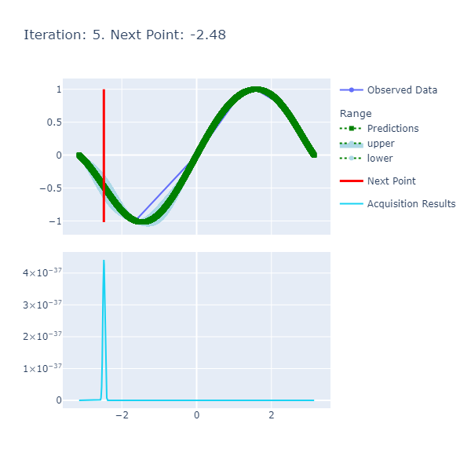

# Bayesian Optimization For Performance Tuning in FSharp

This repository encompasses the work I did for my FSharp Advent 2022 submission that write-up for which can be found [here](AdventSubmission.md); the submission is a good starting point to understand the rationale and underlying concepts.

## Prerequisites

__Experiments__: To get started with viewing the experiments, run [Install.cmd](Install.cmd) that will install the prerequisites to run [PolyGlot Notebooks](https://devblogs.microsoft.com/dotnet/dotnet-interactive-notebooks-is-now-polyglot-notebooks/).

## Basic Usage

```fsharp
// Create a Gaussian Process Model based on the Squared Exponential Kernel for the Sin Function.
let gaussianModelForSin() : GaussianModel =
    let squaredExponentialKernelParameters : SquaredExponentialKernelParameters = { LengthScale = 1.; Variance = 1. }
    let gaussianProcess : GaussianProcess =  createProcessWithSquaredExponentialKernel squaredExponentialKernelParameters
    let sinObjectiveFunction : ObjectiveFunction = QueryContinuousFunction Trig.Sin
    createModel gaussianProcess sinObjectiveFunction -Math.PI Math.PI resolution

// Maximize the Sin Function between -π and π for 10 iterations.
let model         : GaussianModel = gaussianModelForSin()
let optimaResults : OptimaResults = findOptima model Goal.Max 10
printfn "Optima: Sin(x) is maximized when x = %A at %A" optimaResults.Optima.X optimaResults.Optima.Y
```
## Some FAQs

### What are the Inputs of the Model To Get A Basic Run Going?

1. __Kernel Parameters For the Squared Exponential Kernel: Length Scale and Variance__: The length controls the smoothness between the points while the Variance controls the vertical amplitude. A more comprehensive explanation can be found [here](https://peterroelants.github.io/posts/gaussian-process-kernels/#Exponentiated-quadratic-kernel) but in a nutshell, the length scale determines the length of the 'wiggles' in your function and the variance determines how far out the function can fluctuate.

2. __Resolution__: Our priors are uniformly initialized as a list ranging from the min and max provided when we create the model. The resolution indicates the number of elements we'd want in the priors that'll be initialized as a uniform list. The code for this is as follows:

```fsharp 
// src/Optimization.Core/Model.fs

let inputs : double list = seq { for i in 0 .. (resolution - 1) do i }
                           |> Seq.map(fun idx -> min + double idx * (max - min) / (double resolution - 1.))
                           |> Seq.toList
```

The idea here is to use a higher resolution where precision is of paramount importance i.e. you can guess that the optima will require many digits after the decimal point. 

3. __Iterations__: The number of iterations the Bayesian Optimization Algorithm should run for i.e. the number of times the objective function will be computed by running the workload to get to the optima. The more the better, however, we'd be wasting cycles if we have already reached the maxima and are continuing to iterate; this can be curtailed by early stopping.

4. __Range__: The Min and Max whose inclusive interval we want to optimize on.

### How Do I Interpret the Charts of the Algorithm Below? 

An example of a chart the algorithm is:



Here are the details:

1. __Predictions__: The predictions represent the mean of the results obtained from the underlying model that's the approximate of the unknown objective function. This model is also known as the Surrogate Model and more details about this can be found [here](#surrogate-model). The blue ranges indicate the area between the upper and lower limits based on the confidence generated by the posterior.
2. __Acquisition Results__ series represents the acquisition function whose maxima indicates where it is best to search. More details on how the next point to search is discerned can be found [here](#acquisition-function).
3. __Next Point__: The next point is derived from the maximization of the acquisition function and points to where we should sample next.
4. __Observed Data__: The observed data is the data collected from iteratively maximizing the acquisition function. As the number of observed data points increases with increased iterations, the expectation is that the predictions and observed data points converge if the model parameters are set correctly.

Now that a basic definition, reason and other preliminary questions and answers for using Bayesian Optimization are presented, I want to provide some pertinent examples that'll help with contextualizing the associated ideas and highlight the usage of the library.

## Experiments To Highlight Use Cases

1. [Sin](Experiments/Sin/Sin.ipynb)
2. [Simple Workload](Experiments/SimpleWorkload/SimpleWorkload.ipynb)
3. [High Memory Bursty Allocations](Experiments/HighMemoryBurstyAllocations/Program.fs)

## References

1. [Gaussian Processes](http://krasserm.github.io/2018/03/19/gaussian-processes/)
2. [More About Gaussian Processes](https://peterroelants.github.io/posts/gaussian-process-tutorial/)
3. [Bayesian Optimization From Scratch](https://machinelearningmastery.com/what-is-bayesian-optimization/)
4. [Gaussian Processes for Dummies](http://katbailey.github.io/post/gaussian-processes-for-dummies/)
5. [Heavily Inspired by this Repository](https://github.com/koryakinp/GP)
6. [More About the Squared Exponential Kernel](https://peterroelants.github.io/posts/gaussian-process-kernels/#Exponentiated-quadratic-kernel)

## TODO

1. ~~Test out model on a simple Sin function as the objective.~~
2. ~~Create a simple command line app that easily helps us reach some extrema.~~
3. ~~Start working on the infrastructure that orchestrates runs.~~
   1. ~~Criteria:~~
      1. ~~Execution Time~~
      2. ~~Some Aggregate Trace Property~~
4. ~~Adding Discrete Bayesian Optimization.~~
   ~~1. Add the case where we don't try out values we have tried before.~~
5. ~~Abstracting Out The Kernel Method.~~ 
6. ~~Abstracting Out The Acquisition Function.~~
7. ~~Visualization.~~
   1. ~~Save plot as png.~~
   2. ~~Creating Gif Out Of Iterations.~~
8. ~~Creating Notebooks / Experimental Console Apps:~~
   1. ~~Sin Function.~~
   2. ~~Simple Workload.~~
   3. ~~High Memory Load Based Bursty Allocations.~~
9.  ~~Unit Tests.~~
10. Clean up main logic.
   1. Possibly add computation expressions.
   2. Possibly add ROP-esque behavior.
11. Finish writing the article.
12. Early Stopping.
13. Abstract behavior of the Observation Points.